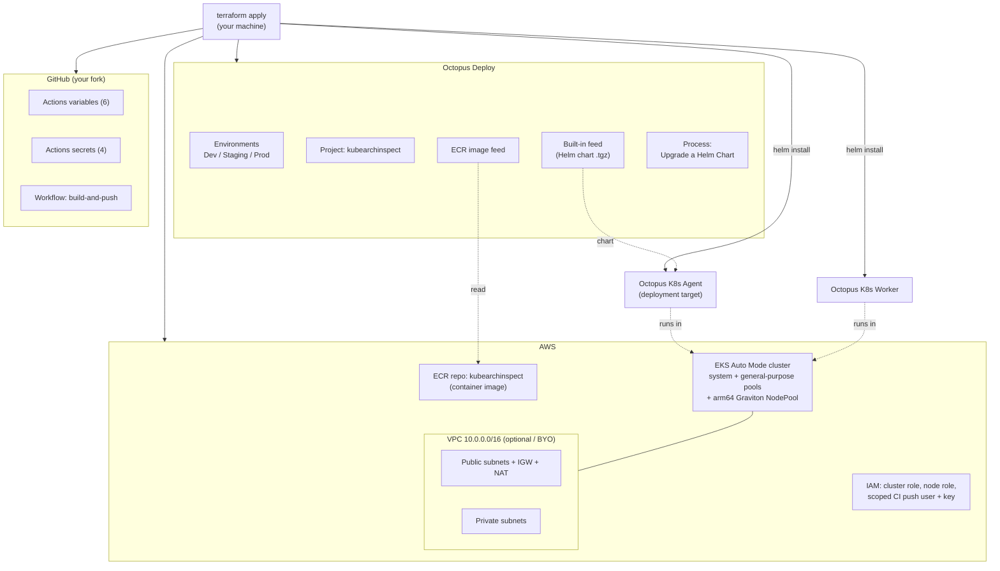
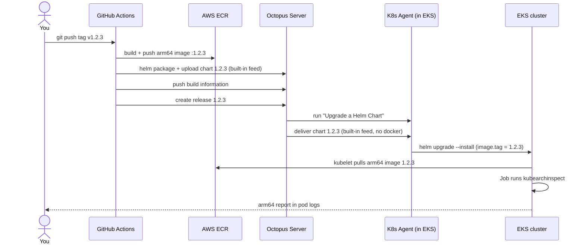

# kubearchinspect on EKS Graviton — end to end

> [!WARNING]
> **🚧 Testing phase.** This repository is an experimental lab/demo under active
> development and is **not** production-ready. Expect breaking changes, gaps, and
> rough edges, and note that a full `terraform apply` of the whole module has not
> yet been end-to-end verified (see [Known caveats](#known-caveats)). Run it in a
> throwaway/sandbox AWS account and a non-production Octopus space, review the code
> before you apply it, and `terraform destroy` when you're done. Use at your own risk.

This repository provisions a complete, working pipeline from three credentials. A
single `terraform apply` stands up an **AWS EKS Auto Mode cluster on arm64
(Graviton)**, an **ECR** registry, a fully configured **Octopus Deploy** project
(feeds, environments, deployment process, plus a Kubernetes agent and worker
running *inside* the cluster), and wires up **GitHub Actions** in your fork.

After that, pushing a `v*.*.*` git tag to your fork builds an arm64 container
image, packages the Helm chart, pushes both to ECR, and creates an Octopus
release that deploys [**kubearchinspect**](https://github.com/ArmDeveloperEcosystem/kubearchinspect)
— Arm's tool that scans every image running in the cluster and reports whether it
has arm64 support. It's the natural "did everything actually land on Graviton?"
check for an arm64 platform.

---

## Table of contents

1. [How it works](#how-it-works)
2. [Architecture](#architecture)
3. [What gets created](#what-gets-created)
4. [Prerequisites](#prerequisites)
5. [Setup, step by step](#setup-step-by-step)
   - [1. Fork this repository](#1-fork-this-repository)
   - [2. Create a GitHub fine-grained token](#2-create-a-github-fine-grained-token)
   - [3. Create an Octopus account and API key](#3-create-an-octopus-account-and-api-key)
   - [4. Authenticate to AWS](#4-authenticate-to-aws)
   - [5. Configure and apply](#5-configure-and-apply)
   - [6. Trigger the pipeline](#6-trigger-the-pipeline)
7. [Verifying the result](#verifying-the-result)
8. [Tearing it down](#tearing-it-down)
9. [Cost and security notes](#cost-and-security-notes)
10. [Known caveats](#known-caveats)
11. [Repository layout](#repository-layout)

---

## How it works

There are two distinct phases. **Provisioning** happens once, with Terraform.
**Release** happens every time you push a version tag.

**Provisioning (`terraform apply`).** Terraform talks to three systems at once.
Against **AWS** it builds a VPC (or uses yours), an EKS Auto Mode cluster with an
arm64 Graviton node pool, an ECR repository for the image and a second one for the
chart, and the IAM roles plus a scoped CI user. Against the **cluster it just
created** (using `aws eks get-token` for auth, so no kubeconfig juggling) it
installs the Octopus Kubernetes agent and worker via Helm and creates a default
gp3 storage class. Against **Octopus** it creates the environments, project group,
project, an ECR image feed, and the deployment process (the Helm chart is
delivered through Octopus's built-in feed). Against **GitHub** it writes
the Actions variables and secrets your fork's workflow needs.

**Release (push a `v*.*.*` tag).** The GitHub workflow authenticates to ECR,
builds the image for `linux/arm64`, and tags it with the version. It then packages
the Helm chart at the *same* version and pushes it to ECR as an OCI artifact. It
sends build information to Octopus and creates a release numbered with that
version. Octopus runs the "Upgrade a Helm Chart" step on the in-cluster agent,
which pulls the chart from ECR and runs `helm upgrade --install`, setting
`image.tag` to the release number. The chart launches a Kubernetes Job that runs
kubearchinspect; its pod logs are the arm64 compatibility report.

The single thread tying the two phases together is the **version**: the workflow
stamps the image, the chart, and the Octopus release with one number, and the
deploy step feeds that same number back in as the image tag.

---

## Architecture

### What Terraform provisions



### What a tag push does



---

## What gets created

Every resource the module manages, grouped by system. Counts in parentheses are
the defaults; many scale with variables (subnets per AZ, one environment per name,
etc.).

### AWS — networking (`vpc.tf`, only when `create_vpc = true`)

| Resource | Notes |
|---|---|
| `aws_vpc.this` | `10.0.0.0/16` by default |
| `aws_internet_gateway.this` | egress for public subnets |
| `aws_subnet.public` (×3) | one per AZ; host the NAT gateway only (egress path) |
| `aws_subnet.private` (×3) | one per AZ; where EKS Auto Mode places nodes |
| `aws_eip.nat` + `aws_nat_gateway.this` | single NAT by default (cheaper) |
| `aws_route_table.public/private` + associations | public→IGW, private→NAT |

If you set `create_vpc = false`, none of these are created and you supply
`vpc_id` + `subnet_ids` instead.

### AWS — EKS cluster (`cluster.tf`)

| Resource | Notes |
|---|---|
| `aws_eks_cluster.this` | **Auto Mode**; keeps the built-in `system` and `general-purpose` node pools so EKS can self-manage |
| `aws_security_group.cluster` | cluster control-plane SG |
| `aws_eks_access_entry.admin` + `aws_eks_access_policy_association.admin` | grants the Terraform caller `AmazonEKSClusterAdminPolicy` — **required** so the in-cluster `kubectl`/Helm steps are authorized (the AWS provider does not grant this automatically under `authentication_mode = API`) |

### AWS — ARM Graviton node pool (`nodepool.tf`)

| Resource | Notes |
|---|---|
| `local_file.arm_nodepool_manifest` | renders the Karpenter `NodePool` CRD |
| `null_resource.arm_nodepool` | `aws eks update-kubeconfig` + `kubectl apply` the NodePool (arch=arm64, categories c/m/r, gen > 4) |

### AWS — IAM (`iam.tf`)

| Resource | Notes |
|---|---|
| `aws_iam_role.cluster` (+5 policy attachments) | EKS Cluster, Compute, BlockStorage, LoadBalancing, Networking — Auto Mode requires all five, and requires the compute / load-balancing / block-storage capabilities to be enabled together (you can't disable just one). No ELB is ever created unless a Service/Ingress requests one — this lab requests none and the ELB subnet tags are removed — so the cluster stays egress-only. |
| `aws_iam_role.node` (+2 attachments) | minimal worker policy + **ECR pull-only** |

### AWS — ECR + CI identity (`ecr.tf`)

| Resource | Notes |
|---|---|
| `aws_ecr_repository.kubearchinspect` (+ lifecycle policy) | the container image |
| `aws_iam_user.ecr_push` + policy + `aws_iam_access_key.ecr_push` | scoped CI user (created when `create_ecr_push_user = true`) |

### In-cluster Kubernetes (`namespaces.tf`, `ebs-storage.tf`)

| Resource | Notes |
|---|---|
| `kubernetes_namespace.octopus_agent` + service account | hosts the agent |
| `kubernetes_namespace.octopus_workers` + service account | hosts the worker |
| `kubernetes_namespace.environment` (×3) | one per environment — `development`, `staging`, `production` — the deploy and runbook target the namespace matching the environment name (lowercased) |
| `kubernetes_storage_class_v1.ebs_gp3` | gp3, provisioner `ebs.csi.eks.amazonaws.com` (the **built-in** Auto Mode driver), set as default. Backs the agent/worker workspace as a single `ReadWriteOnce` EBS volume (see caveats). |
| `helm_release.aws_ebs_csi_driver` | **only** if `install_ebs_csi_driver = true` — leave it off on Auto Mode |

### Octopus Deploy (`octopus-*.tf`)

| Resource | Notes |
|---|---|
| `octopusdeploy_environment.this` (×3) | Development, Staging, Production |
| `octopusdeploy_project_group.tooling` | "Platform Tooling" |
| `octopusdeploy_lifecycle.kubearchinspect` | custom lifecycle: **auto-deploy Development → auto-deploy Staging → stop** (Production is a manual/optional phase). Also fixes environment ordering. |
| `octopusdeploy_project.kubearchinspect` | the project, on the custom lifecycle above |
| `octopusdeploy_aws_elastic_container_registry.image` | ECR feed for the container image (token auto-refreshed from the CI user's keys) |
| built-in feed (`feeds-builtin`) | where the CI workflow uploads the packaged Helm chart `.tgz`; the deploy step acquires it on the agent over the Tentacle protocol (no docker) |
| `octopusdeploy_variable.namespace` | project variable `Namespace` = `#{Octopus.Environment.Name \| ToLower}` — the per-environment target namespace used by the deploy step and runbook |
| `octopusdeploy_process` + `octopusdeploy_process_step.helm_upgrade` | the "Upgrade a Helm Chart" deployment step |
| `octopusdeploy_runbook.verify` (+ process/step) | the **"Verify kubearchinspect results"** runbook — runs `kubectl` in-cluster on the agent to show the arm64 report |
| `helm_release.octopus_agent` + `null_resource.cleanup_octopus_agent` | installs the agent as a **deployment target** (tags `kubernetes`, `eks-arm`), pinned to arm64/Graviton; deregisters it on destroy |
| `octopusdeploy_static_worker_pool.this` + `helm_release.octopus_worker` | a worker pool and in-cluster workers (arm64/Graviton) |

### GitHub (`github.tf`, written into your fork)

**Variables (6):** `OCTOPUS_SERVICE`, `OCTOPUS_PROJECT`, `OCTOPUS_SPACE`,
`AWS_REGION`, `ECR_REGISTRY`, `ECR_REPOSITORY`.

**Secrets (4):** `AWS_ACCESS_KEY_ID`, `AWS_SECRET_ACCESS_KEY`,
`OCTOPUS_SERVER_URL`, `OCTOPUS_API_KEY`.

---

## Prerequisites

Install locally and have them on your `PATH`:

- **[Terraform](https://developer.hashicorp.com/terraform/install) ≥ 1.6** — runs the whole module
- **[AWS CLI v2](https://docs.aws.amazon.com/cli/latest/userguide/getting-started-install.html)** — used by Terraform's exec-auth, by the node-pool `kubectl` step, and by the workflow (must be v2, not v1)
- **[kubectl](https://kubernetes.io/docs/tasks/tools/)** — the node-pool step applies the NodePool CRD with it
- **[git](https://git-scm.com/downloads)**

You do **not** need the Helm CLI locally (the Helm provider is built in); the
workflow installs Helm on the runner.

Quick check that all four are installed and print their versions.

**macOS / Linux (bash or zsh):**

```bash
check() { command -v "$1" >/dev/null 2>&1 && printf '%-10s %s\n' "$1" "$("$@" 2>/dev/null | head -1)" || printf '%-10s NOT INSTALLED\n' "$1"; }
check terraform version; check aws --version; check kubectl version --client; check git --version
```

**Windows (PowerShell):**

```powershell
[ordered]@{terraform='version'; aws='--version'; kubectl='version --client'; git='--version'}.GetEnumerator() | ForEach-Object { if (Get-Command $_.Key -ErrorAction SilentlyContinue) { $v = (& $_.Key ($_.Value -split ' ') 2>$null | Select-Object -First 1); '{0,-10} {1}' -f $_.Key, $v } else { '{0,-10} NOT INSTALLED' -f $_.Key } }
```

The two hard requirements are `terraform` ≥ 1.6 and `aws-cli/2.x` (v1 won't work);
any reasonably recent `kubectl` and `git` are fine. Example of a passing run:

```text
terraform  Terraform v1.9.5
aws        aws-cli/2.17.20 Python/3.12.4 Linux/6.8.0 exe/x86_64
kubectl    Client Version: v1.30.2
git        git version 2.45.2
```

You'll also need three accounts/credentials, covered next: an **AWS** account your
terminal can authenticate to, a **GitHub** account (to fork and to mint a token),
and an **Octopus** account (server URL + API key).

---

## Setup, step by step

### 1. Fork this repository

On the upstream repository page, click **Fork** (top right) and create the fork
under your user or org. Note the resulting `owner/name` — you'll pass them as
`github_owner` and `github_repository`. The fork already contains the workflow at
`.github/workflows/build-and-push.yaml` (repo root, where GitHub Actions discovers
it); Terraform only fills in its secrets and variables.

### 2. Create a GitHub fine-grained token

The Terraform GitHub provider needs a token that can write Actions secrets and
variables to your fork — nothing more.

1. Go to **github.com → your avatar → Settings → Developer settings → Personal
   access tokens → Fine-grained tokens** → **Generate new token**.
2. **Token name**: e.g. `kubearchinspect-terraform`. Set an **Expiration**.
3. **Resource owner**: the account or org that owns your fork.
4. **Repository access**: choose **Only select repositories** and select your
   fork.
5. **Repository permissions** — set exactly these:
   - **Metadata** → **Read-only** (mandatory; selected automatically)
   - **Secrets** → **Read and write**
   - **Variables** → **Read and write**
6. **Generate token** and copy it (it starts with `github_pat_`). You won't see it
   again.

Export it so Terraform picks it up (don't put it in a file):

```bash
export TF_VAR_github_token="github_pat_xxxxxxxxxxxx"
```

> If you use a classic token instead, the equivalent is the `repo` scope — but the
> fine-grained token above is the least-privilege option.

### 3. Create an Octopus account and API key

**Sign up.** If you don't already have an instance, start a free trial at
[octopus.com](https://octopus.com) and create an **Octopus Cloud** instance. Your
instance gets a URL like `https://your-name.octopus.app` — that URL is both your
`octopus_server_url` and `octopus_polling_url`. A fresh instance has one space
named **Default** (`Spaces-1`).

**Create the "ARM Exercise" space.** This lab runs in its own space so it stays
isolated from anything else on your instance.

1. In the Octopus Web Portal, click the **space switcher** (the current space
   name, top-left) → **Add New Space** — or go to **Configuration → Spaces → Add
   Space**.
2. Name it exactly **`ARM Exercise`**.
3. When prompted, nominate yourself (or a team) as the **Space Manager**, then
   **Save**.

> If your plan only permits a single space, skip this and use the **Default**
> space instead (`octopus_space_id = "Spaces-1"`, `octopus_space_name = "Default"`).

**Find the space ID.** Octopus gives each space an ID like `Spaces-2` — the
number depends on how many spaces exist, so look it up rather than assume it.
Either:

- **From the URL** (no API key needed) — switch into the ARM Exercise space and
  read the address bar: `https://your-name.octopus.app/app#/Spaces-NN/...`. That
  `Spaces-NN` is the ID.
- **From the API** (after you create the API key, below) — run:

  ```bash
  curl -s -H "X-Octopus-ApiKey: $TF_VAR_octopus_api_key" \
    "https://your-name.octopus.app/api/spaces/all" \
    | jq -r '.[] | select(.Name=="ARM Exercise") | .Id'
  ```

Set both variables to match your space:

```hcl
octopus_space_id   = "Spaces-NN"      # the ID you looked up
octopus_space_name = "ARM Exercise"
```

**Create an API key.**

1. Log into the Octopus Web Portal.
2. Click your **profile picture** (top right) → **Profile**.
3. Open **My API Keys** → **New API Key**.
4. Enter a **purpose** (e.g. `terraform`) and click **Generate New**.
5. **Copy the key immediately** — it's shown only once and starts with `API-`.
   (By default it's valid for 180 days.)

Export it:

```bash
export TF_VAR_octopus_api_key="API-xxxxxxxxxxxxxxxxxxxx"
```

### 4. Authenticate to AWS

Authenticate your terminal however you normally do — `aws configure`, SSO
(`aws sso login`), or environment variables. Terraform's AWS provider, the
exec-auth for the cluster, and the node-pool `kubectl` step all use these ambient
credentials; **no AWS keys go in the Terraform files**.

The credentials need permission to create EKS, EC2/VPC, IAM, and ECR resources.
For a demo, broad permissions are simplest. If your account can't create VPCs, set
`create_vpc = false` and supply an existing `vpc_id` + `subnet_ids`.

Verify you're authenticated:

```bash
aws sts get-caller-identity
```

Then **preflight the permissions** — this confirms, without creating anything,
that your principal is actually allowed to perform the module's key actions (it
uses `aws iam simulate-principal-policy`):

```bash
bash scripts/preflight-aws.sh            # macOS / Linux
```

```powershell
pwsh scripts/preflight-aws.ps1           # Windows (or: powershell -File scripts\preflight-aws.ps1)
```

It prints ✅/❌ per action and exits non-zero if any are denied, pointing you at
the bring-your-own toggles for whatever you can't create. It needs
`iam:SimulatePrincipalPolicy` — if your principal lacks even that, the script says
so, which isn't the same as lacking the apply permissions. For SSO/assumed roles it
auto-resolves the underlying role ARN, or you can pass one explicitly:
`bash scripts/preflight-aws.sh <role-arn>`.

### 5. Configure and apply

```bash
cd terraform/amazon
cp terraform.tfvars.example terraform.tfvars
```

Edit `terraform.tfvars` and set at least:

```hcl
github_owner      = "your-org-or-user"
github_repository = "kubearchinspect"     # the name of YOUR fork

octopus_server_url  = "https://your-name.octopus.app"
octopus_polling_url = "https://your-name.octopus.app"
octopus_space_id    = "Spaces-NN"      # ID of your ARM Exercise space (see step 3)
octopus_space_name  = "ARM Exercise"

aws_region   = "us-east-1"
cluster_name = "dvb-eks-arm"
```

Everything else has working defaults. Then:

```bash
terraform init
terraform apply
```

The first apply takes roughly 15–20 minutes (most of it the EKS control plane).
The agent and worker register themselves with Octopus near the end.

### 6. Trigger the pipeline

Push a semver tag to your fork:

```bash
git tag v0.7.1
git push origin v0.7.1
```

(or run the **build-and-push** workflow manually from the Actions tab and supply a
version). Watch it under your fork's **Actions** tab.

---

## Verifying the result

**In GitHub:** the workflow shows the image and chart pushed and "release … created".

**In Octopus:** the project has a new release whose number matches your tag, with a
deployment to Development.

**The arm64 report — via the verification runbook.** Terraform creates a runbook,
**Verify kubearchinspect results**, on the kubearchinspect project. It runs in the
cluster on the Octopus agent, so you need no local `kubectl` or kubeconfig — the
agent already has cluster access and reads the Job's status and pod logs for you.

In the portal: **Projects → kubearchinspect → Operations → Runbooks → Verify
kubearchinspect results → Run**, pick the environment you deployed to (e.g.
**Development**), and **Run**. The task log shows the Job status and the report.

Or from the command line with the [Octopus CLI](https://octopus.com/docs/octopus-rest-api/cli):

```bash
octopus runbook run \
  --project kubearchinspect \
  --name "Verify kubearchinspect results" \
  --environment Development \
  --space "ARM Exercise"
```

The report legend: `✅` arm64-compatible, `🆙` compatible after an update, `❌` not
compatible, `🚫` error. Anything but `✅`/`🆙` is an image that won't run on your
Graviton nodes.

> The kubearchinspect Job auto-deletes ~10 minutes after it finishes
> (`job.ttlSecondsAfterFinished`), so run the runbook shortly after a deployment.
> Prefer to check locally and have `kubectl`? Run
> `aws eks update-kubeconfig --name <cluster> --region <region>`, then
> `kubectl logs -n <environment> -l app.kubernetes.io/name=kubearchinspect`
> (the namespace matches the environment name in lowercase, e.g. `development`).

---

## Tearing it down

```bash
cd terraform/amazon
terraform destroy
```

The agent's cleanup resource deregisters it from Octopus first, and
`ecr_force_delete = true` lets the ECR repos be removed even with images in them.
If a destroy stalls on in-cluster objects, confirm your terminal still has cluster
access (`aws eks update-kubeconfig …`) so the Kubernetes/Helm providers can reach
the API server.

---

## Cost and security notes

**Cost.** This is real infrastructure: the EKS control plane bills hourly, the NAT
gateway has an hourly + data charge, and Graviton nodes plus EBS volumes bill while
they run. Set `arm_capacity_type = "spot"` to cut node cost, and run
`terraform destroy` when you're done with the demo.

**Security.** With `create_ecr_push_user = true` the module mints a long-lived IAM
access key, stores it in Terraform state, and writes it to GitHub Actions secrets.
That's the simplest bootstrap, but for anything beyond a demo prefer **GitHub
OIDC**: set `create_ecr_push_user = false`, create an IAM role that trusts GitHub's
OIDC issuer, and point the workflow and the Octopus ECR feeds at it (the feed
resource supports an `oidc_authentication` block). The workflow already requests
`id-token: write`. Keep `terraform.tfvars` and your state out of version control —
the included `.gitignore` already excludes `*.tfvars` and state files.

---

## Known caveats

- **The Helm chart is delivered via Octopus's built-in feed, not ECR.** An AWS
  ECR feed always acquires with Octopus's docker-based package downloader. On a
  Kubernetes Agent the step runs in a script pod whose image ships `helm` and
  `kubectl` but not `docker`, so acquiring an ECR/OCI chart on the agent fails
  with `docker: command not found`. Octopus has no OCI/Helm feed type for the
  Helm step yet (roadmap only), so to keep acquisition **on the agent, in-cluster,
  with no docker and without the Server running the step**, the CI workflow
  `octopus package upload`s the packaged chart to the built-in feed and the deploy
  step sets `primary_package.acquisition_location = "ExecutionTarget"`. The built-in
  feed transfers the package over the Tentacle protocol. The container **image**
  still lives in ECR and is pulled directly by the kubelet. Changing the deployment
  process means you must create a **new release** (releases snapshot the process)
  before redeploy.
- **Workflow / chart layout.** GitHub Actions only discovers workflows at the
  repository **root** (`.github/workflows/`) — a `.github` nested in a
  subdirectory is silently ignored. So the workflow lives at the repo root and
  references the chart and Dockerfile under `kubearchinspect/` explicitly
  (`context: ./kubearchinspect`, `file: ./kubearchinspect/Dockerfile`,
  `helm package ./kubearchinspect`). The chart name in `Chart.yaml`
  (`kubearchinspect`) matches `ECR_REPOSITORY`, so the packaged
  `kubearchinspect-<version>.tgz` lines up with the chart push. If you relocate
  the chart, update those three paths together.
- **Agent before first deploy.** The agent must be registered (end of `apply`)
  before the first release deploys, so the step's target tags resolve. On a brand
  new instance, let `apply` finish fully before pushing a tag.
- **SSO / Identity Center callers.** The cluster-admin access entry needs a
  permanent IAM **role** ARN, not the STS *session* ARN. When you authenticate
  via AWS SSO, the config auto-resolves your session to its real role ARN (full
  `…/aws-reserved/sso.amazonaws.com/<region>/AWSReservedSSO_…` path, which access
  entries accept) by looking the role up with `iam:GetRole`. If your principal
  can't call `GetRole`, or the resolved ARN doesn't match at token-auth time and
  the in-cluster steps still return `Unauthorized`, set `cluster_admin_principal_arn`
  in your tfvars to the exact ARN — the path-stripped form
  `arn:aws:iam::<acct>:role/AWSReservedSSO_<name>_<slug>` is the usual fallback —
  and re-apply. The cluster already exists, so the re-apply only retries the
  access entry and the resources gated behind it (fast, no 13-minute wait).
- **Octopus Cloud polling address.** The agent/worker register as polling
  Tentacles, and Octopus Cloud serves polling comms on a dedicated host — the
  instance URL with a `polling.` prefix (`https://polling.<name>.octopus.app`),
  not the portal URL. Handing the portal URL to the Tentacle makes its
  pre-registration connectivity check return a `404` and the pod exits with code
  100. The config auto-derives the `polling.` host for `*.octopus.app`; for a
  self-hosted server set `octopus_polling_url` explicitly (e.g.
  `https://octopus.example.com:10943`).
- **Workspace storage is EBS `ReadWriteOnce` (chart 3.x required).** The agent
  tentacle pod and its ephemeral script pods share one workspace volume. EBS is
  block storage and attaches to a single node, so it only supports
  `ReadWriteOnce` — that's a hard EBS constraint, not a CSI misconfiguration (the
  Auto Mode EBS CSI is built-in and managed; an empty `kube-system` is normal).
  On older agent charts (e.g. 2.36.0) the workspace was hardcoded to
  `ReadWriteMany`, so a bare EBS PVC stayed `Pending` and the Helm install timed
  out with `context deadline exceeded`. Chart **3.x** makes `ReadWriteOnce` the
  supported default: the tentacle is a single pod and co-locates its script pods
  on its own node, so one RWO EBS volume serves both. This repo pins
  `octopus_agent_chart_version = 3.5.0` and sets `persistence.accessModes =
  ["ReadWriteOnce"]` with NFS disabled. (Chart 3.x also removed multi-replica
  tentacles — concurrency now comes from script pods — so there's no worker
  replica count.)
- **arm64 / Graviton pinning.** The tentacle pods are pinned to
  `kubernetes.io/arch=arm64` via `agent.nodeSelector` (from `arm_pod_node_selector`);
  the EKS Auto Mode general-purpose NodePool is amd64-only, so this routes them to
  the custom Graviton NodePool. The script pods don't need their own selector —
  the chart's RWO co-location schedules them onto the agent's (arm64) node, so they
  inherit Graviton. Override `arm_pod_node_selector` to pin to a specific pool,
  e.g. `{ "karpenter.sh/nodepool" = "<arm-pool-name>" }`.

---

## Repository layout

```
.
├── README.md                      <- you are here
├── .gitignore
├── .github/workflows/
│   └── build-and-push.yaml        <- build image + chart, create Octopus release
├── scripts/
│   ├── preflight-aws.sh           <- pre-apply AWS permissions check (bash)
│   └── preflight-aws.ps1          <- same check for Windows (PowerShell)
├── kubearchinspect/               <- Helm chart + Dockerfile
│   ├── Chart.yaml
│   ├── Dockerfile                 <- builds the arm64 image
│   ├── values.yaml
│   └── templates/                 <- Job, RBAC, ServiceAccount, helpers
└── terraform/amazon/              <- the single Terraform module
    ├── README.md                  <- module-level detail & variable reference
    ├── versions.tf  providers.tf  variables.tf  outputs.tf
    ├── vpc.tf  cluster.tf  iam.tf  nodepool.tf
    ├── ecr.tf  github.tf
    ├── ebs-storage.tf  namespaces.tf
    └── octopus-feeds.tf  octopus-environments.tf  octopus-project.tf
        octopus-process.tf  octopus-runbook.tf  octopus-agent.tf  octopus-worker.tf
```

For the full variable reference and bring-your-own-VPC/OIDC details, see
[`terraform/amazon/README.md`](terraform/amazon/README.md).
