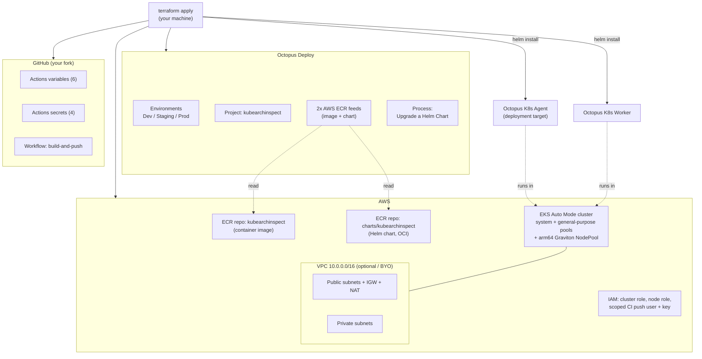
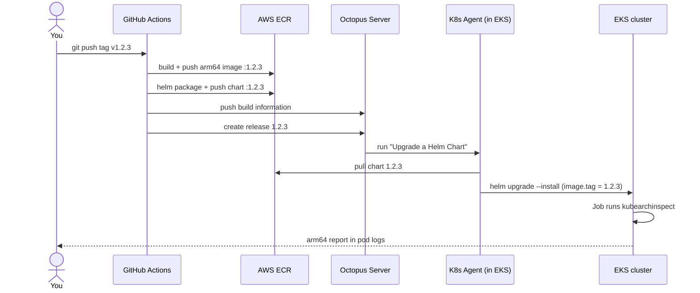

# kubearchinspect on EKS Graviton — end to end

This repository provisions a complete, working pipeline from three credentials. A
single `terraform apply` stands up an **AWS EKS Auto Mode cluster on arm64
(Graviton)**, an **ECR** registry, a fully configured **Octopus Deploy** project
(feeds, environments, deployment process, plus a Kubernetes agent and worker
running *inside* the cluster), and wires up **GitHub Actions** in your fork.

After that, pushing a `v*.*.*` git tag to your fork builds an arm64 container
image, packages the Helm chart, pushes both to ECR, and creates an Octopus
release that deploys [**kubearchinspect**](https://github.com/ArmDeveloperEcosystem/kubearchinspect)
— Arm's tool that scans every image running in the cluster and reports whether it
has arm64 support. It's the natural "did everything actually land on Graviton?"
check for an arm64 platform.

---

## Table of contents

1. [How it works](#how-it-works)
2. [Architecture](#architecture)
3. [What gets created](#what-gets-created)
4. [Prerequisites](#prerequisites)
5. [Setup, step by step](#setup-step-by-step)
   - [1. Fork this repository](#1-fork-this-repository)
   - [2. Create a GitHub fine-grained token](#2-create-a-github-fine-grained-token)
   - [3. Create an Octopus account and API key](#3-create-an-octopus-account-and-api-key)
   - [4. Authenticate to AWS](#4-authenticate-to-aws)
   - [5. Configure and apply](#5-configure-and-apply)
   - [6. Trigger the pipeline](#6-trigger-the-pipeline)
7. [Verifying the result](#verifying-the-result)
8. [Tearing it down](#tearing-it-down)
9. [Cost and security notes](#cost-and-security-notes)
10. [Known caveats](#known-caveats)
11. [Repository layout](#repository-layout)

---

## How it works

There are two distinct phases. **Provisioning** happens once, with Terraform.
**Release** happens every time you push a version tag.

**Provisioning (`terraform apply`).** Terraform talks to three systems at once.
Against **AWS** it builds a VPC (or uses yours), an EKS Auto Mode cluster with an
arm64 Graviton node pool, an ECR repository for the image and a second one for the
chart, and the IAM roles plus a scoped CI user. Against the **cluster it just
created** (using `aws eks get-token` for auth, so no kubeconfig juggling) it
installs the Octopus Kubernetes agent and worker via Helm and creates a default
gp3 storage class. Against **Octopus** it creates the environments, project group,
project, two ECR feeds, and the deployment process. Against **GitHub** it writes
the Actions variables and secrets your fork's workflow needs.

**Release (push a `v*.*.*` tag).** The GitHub workflow authenticates to ECR,
builds the image for `linux/arm64`, and tags it with the version. It then packages
the Helm chart at the *same* version and pushes it to ECR as an OCI artifact. It
sends build information to Octopus and creates a release numbered with that
version. Octopus runs the "Upgrade a Helm Chart" step on the in-cluster agent,
which pulls the chart from ECR and runs `helm upgrade --install`, setting
`image.tag` to the release number. The chart launches a Kubernetes Job that runs
kubearchinspect; its pod logs are the arm64 compatibility report.

The single thread tying the two phases together is the **version**: the workflow
stamps the image, the chart, and the Octopus release with one number, and the
deploy step feeds that same number back in as the image tag.

---

## Architecture

### What Terraform provisions



### What a tag push does



---

## What gets created

Every resource the module manages, grouped by system. Counts in parentheses are
the defaults; many scale with variables (subnets per AZ, one environment per name,
etc.).

### AWS — networking (`vpc.tf`, only when `create_vpc = true`)

| Resource | Notes |
|---|---|
| `aws_vpc.this` | `10.0.0.0/16` by default |
| `aws_internet_gateway.this` | egress for public subnets |
| `aws_subnet.public` (×3) | one per AZ; host the NAT gateway only (egress path) |
| `aws_subnet.private` (×3) | one per AZ; where EKS Auto Mode places nodes |
| `aws_eip.nat` + `aws_nat_gateway.this` | single NAT by default (cheaper) |
| `aws_route_table.public/private` + associations | public→IGW, private→NAT |

If you set `create_vpc = false`, none of these are created and you supply
`vpc_id` + `subnet_ids` instead.

### AWS — EKS cluster (`cluster.tf`)

| Resource | Notes |
|---|---|
| `aws_eks_cluster.this` | **Auto Mode**; keeps the built-in `system` and `general-purpose` node pools so EKS can self-manage |
| `aws_security_group.cluster` | cluster control-plane SG |
| `aws_eks_access_entry.admin` + `aws_eks_access_policy_association.admin` | grants the Terraform caller `AmazonEKSClusterAdminPolicy` — **required** so the in-cluster `kubectl`/Helm steps are authorized (the AWS provider does not grant this automatically under `authentication_mode = API`) |

### AWS — ARM Graviton node pool (`nodepool.tf`)

| Resource | Notes |
|---|---|
| `local_file.arm_nodepool_manifest` | renders the Karpenter `NodePool` CRD |
| `null_resource.arm_nodepool` | `aws eks update-kubeconfig` + `kubectl apply` the NodePool (arch=arm64, categories c/m/r, gen > 4) |

### AWS — IAM (`iam.tf`)

| Resource | Notes |
|---|---|
| `aws_iam_role.cluster` (+5 policy attachments) | EKS Cluster, Compute, BlockStorage, LoadBalancing, Networking — the full Auto Mode role set AWS recommends. The load-balancing *capability* is disabled on the cluster (egress-only lab), so that policy stays unused. |
| `aws_iam_role.node` (+2 attachments) | minimal worker policy + **ECR pull-only** |

### AWS — ECR + CI identity (`ecr.tf`)

| Resource | Notes |
|---|---|
| `aws_ecr_repository.kubearchinspect` (+ lifecycle policy) | the container image |
| `aws_ecr_repository.chart` | `charts/kubearchinspect`, kept separate so the chart's OCI artifact doesn't collide with the image |
| `aws_iam_user.ecr_push` + policy + `aws_iam_access_key.ecr_push` | scoped CI user (created when `create_ecr_push_user = true`) |

### In-cluster Kubernetes (`namespaces.tf`, `ebs-storage.tf`)

| Resource | Notes |
|---|---|
| `kubernetes_namespace.octopus_agent` + service account | hosts the agent |
| `kubernetes_namespace.octopus_workers` + service account | hosts the worker |
| `kubernetes_storage_class_v1.ebs_gp3` | gp3, provisioner `ebs.csi.eks.amazonaws.com` (the **built-in** Auto Mode driver), set as default |
| `helm_release.aws_ebs_csi_driver` | **only** if `install_ebs_csi_driver = true` — leave it off on Auto Mode |

### Octopus Deploy (`octopus-*.tf`)

| Resource | Notes |
|---|---|
| `octopusdeploy_environment.this` (×3) | Development, Staging, Production |
| `octopusdeploy_project_group.tooling` | "Platform Tooling" |
| `octopusdeploy_project.kubearchinspect` | the project, on the Default lifecycle |
| `octopusdeploy_aws_elastic_container_registry.image` / `.chart` | two ECR feeds (token auto-refreshed from the CI user's keys) |
| `octopusdeploy_process` + `octopusdeploy_process_step.helm_upgrade` | the "Upgrade a Helm Chart" deployment step |
| `helm_release.octopus_agent` + `null_resource.cleanup_octopus_agent` | installs the agent as a **deployment target** (tags `kubernetes`, `eks-arm`); deregisters it on destroy |
| `octopusdeploy_static_worker_pool.this` + `helm_release.octopus_worker` | a worker pool and in-cluster workers |

### GitHub (`github.tf`, written into your fork)

**Variables (6):** `OCTOPUS_SERVICE`, `OCTOPUS_PROJECT`, `OCTOPUS_SPACE`,
`AWS_REGION`, `ECR_REGISTRY`, `ECR_REPOSITORY`.

**Secrets (4):** `AWS_ACCESS_KEY_ID`, `AWS_SECRET_ACCESS_KEY`,
`OCTOPUS_SERVER_URL`, `OCTOPUS_API_KEY`.

---

## Prerequisites

Install locally and have them on your `PATH`:

- **Terraform** ≥ 1.6
- **AWS CLI v2** — used by Terraform's exec-auth, by the node-pool `kubectl`
  step, and by the workflow
- **kubectl** — the node-pool step applies the NodePool CRD with it
- **git**

You do **not** need the Helm CLI locally (the Helm provider is built in); the
workflow installs Helm on the runner.

You'll also need three accounts/credentials, covered next: an **AWS** account your
terminal can authenticate to, a **GitHub** account (to fork and to mint a token),
and an **Octopus** account (server URL + API key).

---

## Setup, step by step

### 1. Fork this repository

On the upstream repository page, click **Fork** (top right) and create the fork
under your user or org. Note the resulting `owner/name` — you'll pass them as
`github_owner` and `github_repository`. The fork already contains the workflow at
`kubearchinspect/.github/workflows/build-and-push.yaml`; Terraform only fills in
its secrets and variables.

### 2. Create a GitHub fine-grained token

The Terraform GitHub provider needs a token that can write Actions secrets and
variables to your fork — nothing more.

1. Go to **github.com → your avatar → Settings → Developer settings → Personal
   access tokens → Fine-grained tokens** → **Generate new token**.
2. **Token name**: e.g. `kubearchinspect-terraform`. Set an **Expiration**.
3. **Resource owner**: the account or org that owns your fork.
4. **Repository access**: choose **Only select repositories** and select your
   fork.
5. **Repository permissions** — set exactly these:
   - **Metadata** → **Read-only** (mandatory; selected automatically)
   - **Secrets** → **Read and write**
   - **Variables** → **Read and write**
6. **Generate token** and copy it (it starts with `github_pat_`). You won't see it
   again.

Export it so Terraform picks it up (don't put it in a file):

```bash
export TF_VAR_github_token="github_pat_xxxxxxxxxxxx"
```

> If you use a classic token instead, the equivalent is the `repo` scope — but the
> fine-grained token above is the least-privilege option.

### 3. Create an Octopus account and API key

**Sign up.** If you don't already have an instance, start a free trial at
[octopus.com](https://octopus.com) and create an **Octopus Cloud** instance. Your
instance gets a URL like `https://your-name.octopus.app` — that URL is both your
`octopus_server_url` and `octopus_polling_url`. A fresh instance has one space
named **Default**, whose ID is **`Spaces-1`** (`octopus_space_id = "Spaces-1"`,
`octopus_space_name = "Default"`).

**Create an API key.**

1. Log into the Octopus Web Portal.
2. Click your **profile picture** (top right) → **Profile**.
3. Open **My API Keys** → **New API Key**.
4. Enter a **purpose** (e.g. `terraform`) and click **Generate New**.
5. **Copy the key immediately** — it's shown only once and starts with `API-`.
   (By default it's valid for 180 days.)

Export it:

```bash
export TF_VAR_octopus_api_key="API-xxxxxxxxxxxxxxxxxxxx"
```

### 4. Authenticate to AWS

Authenticate your terminal however you normally do — `aws configure`, SSO
(`aws sso login`), or environment variables. Terraform's AWS provider, the
exec-auth for the cluster, and the node-pool `kubectl` step all use these ambient
credentials; **no AWS keys go in the Terraform files**.

The credentials need permission to create EKS, EC2/VPC, IAM, and ECR resources.
For a demo, broad permissions are simplest. If your account can't create VPCs, set
`create_vpc = false` and supply an existing `vpc_id` + `subnet_ids`.

Verify:

```bash
aws sts get-caller-identity
```

### 5. Configure and apply

```bash
cd terraform/amazon
cp terraform.tfvars.example terraform.tfvars
```

Edit `terraform.tfvars` and set at least:

```hcl
github_owner      = "your-org-or-user"
github_repository = "kubearchinspect"     # the name of YOUR fork

octopus_server_url  = "https://your-name.octopus.app"
octopus_polling_url = "https://your-name.octopus.app"
octopus_space_id    = "Spaces-1"

aws_region   = "us-east-1"
cluster_name = "dvb-eks-arm"
```

Everything else has working defaults. Then:

```bash
terraform init
terraform apply
```

The first apply takes roughly 15–20 minutes (most of it the EKS control plane).
The agent and worker register themselves with Octopus near the end.

### 6. Trigger the pipeline

Push a semver tag to your fork:

```bash
git tag v0.7.1
git push origin v0.7.1
```

(or run the **build-and-push** workflow manually from the Actions tab and supply a
version). Watch it under your fork's **Actions** tab.

---

## Verifying the result

**In GitHub:** the workflow shows the image and chart pushed and "release … created".

**In Octopus:** the project has a new release whose number matches your tag, with a
deployment to Development.

**In the cluster:**

```bash
aws eks update-kubeconfig --name dvb-eks-arm --region us-east-1

# the kubearchinspect Job runs in kube-system
kubectl get jobs -n kube-system
kubectl logs -n kube-system -l app.kubernetes.io/name=kubearchinspect -f
```

The log legend: `✅` arm64-compatible, `🆙` compatible after an update, `❌` not
compatible, `🚫` error. Anything but `✅`/`🆙` is an image that won't run on your
Graviton nodes.

---

## Tearing it down

```bash
cd terraform/amazon
terraform destroy
```

The agent's cleanup resource deregisters it from Octopus first, and
`ecr_force_delete = true` lets the ECR repos be removed even with images in them.
If a destroy stalls on in-cluster objects, confirm your terminal still has cluster
access (`aws eks update-kubeconfig …`) so the Kubernetes/Helm providers can reach
the API server.

---

## Cost and security notes

**Cost.** This is real infrastructure: the EKS control plane bills hourly, the NAT
gateway has an hourly + data charge, and Graviton nodes plus EBS volumes bill while
they run. Set `arm_capacity_type = "spot"` to cut node cost, and run
`terraform destroy` when you're done with the demo.

**Security.** With `create_ecr_push_user = true` the module mints a long-lived IAM
access key, stores it in Terraform state, and writes it to GitHub Actions secrets.
That's the simplest bootstrap, but for anything beyond a demo prefer **GitHub
OIDC**: set `create_ecr_push_user = false`, create an IAM role that trusts GitHub's
OIDC issuer, and point the workflow and the Octopus ECR feeds at it (the feed
resource supports an `oidc_authentication` block). The workflow already requests
`id-token: write`. Keep `terraform.tfvars` and your state out of version control —
the included `.gitignore` already excludes `*.tfvars` and state files.

---

## Known caveats

- **Helm step acquisition.** The Octopus provider doesn't strongly-type Helm
  actions, so the deploy step uses raw property keys. The one value worth
  confirming against your Octopus version is `primary_package.acquisition_location`
  for an OCI chart pulled from an ECR feed (set to `ExecutionTarget`). If the step
  can't find the chart, configure it once in the UI and re-export to see the exact
  shape.
- **Chart location.** The workflow assumes the chart (`Chart.yaml`, `Dockerfile`,
  `templates/`) sits at the fork root, matching `context: .` and `helm package .`.
  If your fork keeps it under a `kubearchinspect/` subdirectory, adjust the Docker
  context/file and use `helm package ./kubearchinspect`.
- **Agent before first deploy.** The agent must be registered (end of `apply`)
  before the first release deploys, so the step's target tags resolve. On a brand
  new instance, let `apply` finish fully before pushing a tag.

---

## Repository layout

```
.
├── README.md                      <- you are here
├── .gitignore
├── kubearchinspect/               <- Helm chart, Dockerfile, CI workflow
│   ├── Chart.yaml
│   ├── Dockerfile                 <- builds the arm64 image
│   ├── values.yaml
│   ├── templates/                 <- Job, RBAC, ServiceAccount, helpers
│   └── .github/workflows/
│       └── build-and-push.yaml    <- build image + chart, create Octopus release
└── terraform/amazon/              <- the single Terraform module
    ├── README.md                  <- module-level detail & variable reference
    ├── versions.tf  providers.tf  variables.tf  outputs.tf
    ├── vpc.tf  cluster.tf  iam.tf  nodepool.tf
    ├── ecr.tf  github.tf
    ├── ebs-storage.tf  namespaces.tf
    └── octopus-feeds.tf  octopus-environments.tf  octopus-project.tf
        octopus-process.tf  octopus-agent.tf  octopus-worker.tf
```

For the full variable reference and bring-your-own-VPC/OIDC details, see
[`terraform/amazon/README.md`](terraform/amazon/README.md).
